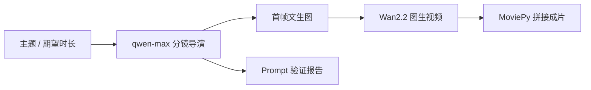

# AI 电影工厂

输入一句话或一段故事，系统自动分镜、生成首帧、逐镜图生视频并拼接，产出最长约一分钟的短片。镜数按主题复杂度或指定时长分配，大约 3 到 12 镜，每镜约 5 秒。



## 项目要点

- **分镜导演**：两阶段生成故事骨架和每镜动作。控制时长预算、连续走路、回头镜和重复动作，并锁定角色外观
- **先验证再渲染**：Gradio 里可以只跑分镜校验，不加载 14B 视频模型
- **画面连贯**：第 1 镜用云端文生图定调，后续镜头按角色锁和动作指令出图，再交给 Wan2.2-I2V-A14B
- **异步取件**：FastAPI 立即返回 task id，Celery + Redis 在 GPU 上渲染。页面可以关掉，凭取件码下载
- **单测**：`tests/test_fluent_directing.py` 覆盖分镜规则，不需要显卡

更早一版技术笔记在 `TECH_STACK.md`。当前推理代码以 Wan2.2 为准。

## 技术栈

| 层 | 选择 |
| --- | --- |
| 界面 | Gradio |
| 接口 | FastAPI |
| 队列 | Celery、Redis |
| 分镜 | Qwen（OpenAI 兼容接口） |
| 视频 | Wan2.2-I2V-A14B、Diffusers、PyTorch |
| 成片 | MoviePy、ffmpeg |

## 本地运行

复制环境变量模板并填写密钥：

```bash
copy .env.example .env
```

需要 `DASHSCOPE_API_KEY`。使用专属接入点时，同时修改 `DASHSCOPE_BASE_URL`。

安装 Web 与队列依赖，并准备 Redis：

```bash
pip install -r requirements.txt
```

GPU 机器上再安装 Wan 运行时（含指定 NumPy / SciPy），并从源码安装较新的 Diffusers：

```bash
pip install --force-reinstall --no-cache-dir -r requirements-wan-runtime.txt
pip install -U "git+https://github.com/huggingface/diffusers"
bash download_wan_model.sh
```

三个进程：

```bash
uvicorn api:app --host 0.0.0.0 --port 8000
celery -A celery_worker worker --loglevel=info --pool=solo
python app.py
```

Gradio 默认在 http://localhost:6006 。加载 14B 模型时请保持 Celery `solo` 池，避免 fork 把显存和内存翻倍。权重建议放在数据盘，脚本默认目录是 `/root/autodl-tmp/models/Wan2.2-I2V-A14B-Diffusers`。

只检查分镜、不渲染视频：

```bash
python validate_prompts.py --topic "赛博朋克雨夜，赏金猎人撑伞走入暗巷"
python -m unittest tests.test_fluent_directing
```

## 目录

```text
app.py                  Gradio：验证 Prompt / 提交渲染 / 凭码取片
api.py                  POST /generate ，GET /status/{task_id}
celery_worker.py        异步渲染任务
llm_director.py         分镜、时长预算、动作约束
video_generator.py      首帧与 Wan2.2 图生视频
video_merger.py         交叉淡化拼接
character_assets.py     角色外观锁定
tests/                  分镜规则单测
```
