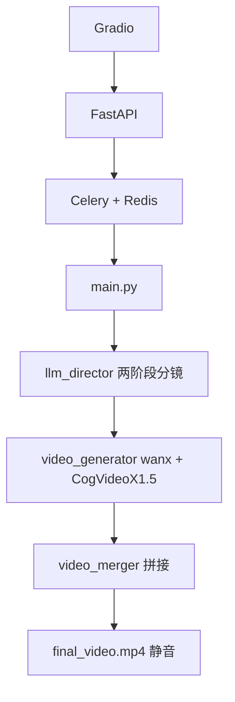
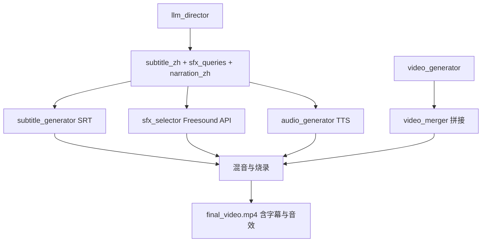

# AI 一分钟视频工厂 · 技术栈

> 当前代码的图生视频模型是 **Wan2.2-I2V-A14B**（Diffusers）。下文前半部分保留了早期 CogVideoX 方案记录，以根目录 README 的流水线为准。

## 项目概述

用户通过 Web 页面输入**一句话或一段故事**作为主题，系统自动完成分镜拆解、首帧生成、图生视频、拼接导出，产出约 50 秒高清短片。

**当前已实现（v2）：**

```
用户输入主题
    → qwen-plus 两阶段分镜（故事骨架 + 分镜 prompt）
    → wanx-v1（第 1 镜高清首帧定调）
    → CogVideoX1.5-5B-I2V（第 2–10 镜承接上一镜末帧）
    → MoviePy + ffmpeg（交叉淡化拼接 + 导出）
    → 最终 MP4（静音）
```

**规划中（v3，尚未接入代码）：**

```
    → qwen-plus 生成旁白文案 + 字幕文案 + 音效搜索词
    → TTS 旁白配音（可选）
    → Freesound API 在线搜索并下载音效
    → MoviePy + ffmpeg 混音 + 烧录字幕
    → 最终 MP4（含字幕与音效）
```

---

## 技术栈总览

| 层级 | 技术 | 用途 | 状态 |
|------|------|------|------|
| 前端 | **Gradio** (`app.py`) | Web UI，提交主题、凭 task_id 查询进度与下载 | 已上线 |
| API | **FastAPI** (`api.py`) | REST 接口 `/generate`、`/status/{task_id}` | 已上线 |
| 任务队列 | **Celery** + **Redis** (`celery_worker.py`) | 异步长任务调度，避免 HTTP 超时 | 已上线 |
| 剧本 / 分镜 | **qwen-plus** (`llm_director.py`) | 两阶段：故事骨架 + 分镜/首帧 prompt | 已上线 |
| 首帧图 | **通义万相 wanx-v1** (`video_generator.py`) | 仅第 1 镜生成首帧，定人物与场景 | 已上线 |
| 图生视频 | **CogVideoX1.5-5B-I2V** (`video_generator.py`) | 1360×768，81 帧 @ 16fps ≈ 5 秒/镜 | 已上线 |
| 视频拼接 | **MoviePy** + **ffmpeg** (`video_merger.py`) | 10 段拼接、0.5s 交叉淡化、24fps 导出 | 已上线 |
| **字幕** | **qwen-plus + SRT + ffmpeg** | 每镜生成中文字幕并烧录 | **规划中** |
| **旁白配音** | **TTS**（DashScope CosyVoice / edge-tts） | 按镜生成中文旁白 | **规划中** |
| **音效** | **qwen-plus + Freesound API** | AI 根据分镜自动搜索免费音效并混音 | **规划中** |
| 深度学习框架 | **PyTorch** + **diffusers** + **transformers** | 模型加载与推理 | 已上线 |
| 运行环境 | **AutoDL**（推荐 24GB 显存 GPU） | 云端 GPU 实例 | 已上线 |

---

## 核心模型配置

### 1. 大语言模型 — qwen-plus

| 项 | 值 |
|----|-----|
| 提供商 | 阿里云 DashScope（OpenAI 兼容接口） |
| 模型 | `qwen-plus` |
| 阶段 A 输出 | `visual_anchor` + 10 拍 `continuity_spine`（开始/动作/结束） |
| 阶段 B 输出 | 10 × `shot_prompts` + 10 × `keyframe_prompts` |
| **v3 规划输出** | 10 × `narration_zh` + 10 × `subtitle_zh` + 10 × `sfx_queries` |
| 环境变量 | `DASHSCOPE_API_KEY`、`DASHSCOPE_BASE_URL` |

**行为：**

- 短主题 → AI 自动扩展为完整 10 镜故事
- 长故事 → 保留用户细节，按时间线拆分
- 每拍 `start_state` 必须衔接上一拍 `end_state`（剧情连贯）
- 第 1 镜 wanx 定调，第 2–10 镜承接上一镜末帧（画面连贯）

---

### 2. 首帧生成 — wanx-v1

| 项 | 值 |
|----|-----|
| 提供商 | 阿里云 DashScope `ImageSynthesis` |
| 模型 | `wanx_v1` |
| 输出尺寸 | `1280*720` |
| 后处理 | 中心裁剪 + LANCZOS 缩放至 **1360×768** |
| 调用频率 | **仅第 1 镜**（1 次/任务）；第 2–10 镜用上一镜末帧 |

---

### 3. 图生视频 — CogVideoX1.5-5B-I2V

| 项 | 值 |
|----|-----|
| 模型 ID | `THUDM/CogVideoX1.5-5B-I2V` |
| 本地路径（AutoDL） | `/root/autodl-tmp/models/CogVideoX1.5-5B-I2V` |
| Pipeline | `CogVideoXImageToVideoPipeline`（diffusers） |
| 分辨率 | **1360 × 768** |
| 帧数 | **81** 帧 / 镜 |
| 帧率 | **16 fps** |
| 单镜时长 | ≈ **5 秒** |
| 成片时长 | 10 镜 ≈ **50 秒** |
| 精度 | `torch.bfloat16` |
| 推理步数 | 50 |
| guidance_scale | 6.0 |
| 动态 CFG | `use_dynamic_cfg=True` |
| 连贯策略 | 首镜 wanx → `identity_reference`；2..N 纯回锚硬切（不再末帧衔接） |

**硬件要求：** 推荐 24GB 显存，峰值约 19GB（offload + VAE 优化）

---

### 4. 后期合成 — MoviePy + ffmpeg（当前 v2）

| 项 | 值 |
|----|-----|
| 拼接 | `concatenate_videoclips` + **0.5s 交叉淡化** |
| 源帧率 | 16 fps |
| 导出帧率 | 24 fps |
| 编码 | H.264，`crf=14`，码率 `24000k` |
| BGM | 接口已预留 `bgm_path`，Celery 尚未接入 |

---

## 规划模块：字幕技术栈（v3）

### 目标

为每镜叠加简体中文硬字幕，与画面时间轴对齐（约 5 秒/镜）。

### 技术选型

| 项 | 方案 |
|----|------|
| 文案来源 | qwen-plus 在分镜阶段为每拍输出 `subtitle_zh`（1–2 句短字幕） |
| 时间轴 | 根据每镜视频实际时长生成 **SRT** 文件 |
| 烧录工具 | **ffmpeg** `subtitles` 滤镜（推荐）或 MoviePy `TextClip` |
| 字体 | `Noto Sans SC` 或 `Microsoft YaHei`（AutoDL 需安装字体包） |
| 输出 | `final_video_{task_id}.mp4`（硬字幕）+ 可选 `subtitles.srt`（软字幕） |

### 数据流

```
continuity_spine / shot_prompts
    → qwen-plus 生成 subtitle_zh[1..10]
    → subtitle_generator.py 生成 subtitles.srt
    → ffmpeg 烧录到成片
```

### 规划文件

| 文件 | 职责 |
|------|------|
| `subtitle_generator.py` | SRT 时间轴生成、ffmpeg 烧录 |
| `assets/fonts/NotoSansSC-Regular.otf` | 字幕字体 |

### 环境变量（规划）

| 变量 | 说明 |
|------|------|
| `SUBTITLE_FONT` | 字幕字体路径 |
| `SUBTITLE_FORCE_STYLE` | ASS/SRT 样式（字号、描边、位置） |

---

## 规划模块：音效技术栈（v3 · Freesound 在线搜索）

### 目标

AI 根据每镜分镜 prompt / 故事骨架，自动在 **Freesound.org** 搜索合适的免费音效，按时间轴混入成片。

### 技术选型

| 项 | 方案 |
|----|------|
| 音效来源 | **Freesound.org**（在线 API，免费注册） |
| 搜索词生成 | qwen-plus 为每拍输出 `sfx_queries`（英文关键词，如 `rain urban alley`, `drone hover sci-fi`） |
| API | Freesound REST API v2（`https://freesound.org/apiv2/`） |
| 认证 | `FREESOUND_API_KEY`（Client API key，OAuth2 可选） |
| 筛选 | 优先 CC0 协议；商用需过滤 NC/ND 许可 |
| 下载 | API 返回 preview / HQ 音频 → 本地缓存 → 裁剪/循环至镜长 |
| 混音 | MoviePy / ffmpeg amix，按镜时间偏移叠加 |
| 音量层次 | 环境音 10–15%，音效 25–35%，旁白 100%，BGM 15–20% |

### 数据流

```
每镜 action / shot_prompt
    → qwen-plus 生成 sfx_queries + sfx_timing
    → sfx_selector.py 调用 Freesound API 搜索
    → 下载最佳匹配 MP3/WAV
    → 对齐该镜 0~5s 时间轴
    → video_merger.py 与视频、旁白、BGM 混音
```

### Freesound API 要点

| 项 | 说明 |
|----|------|
| 注册 | https://freesound.org/apiv2/apply/ 申请 API Key |
| 搜索接口 | `GET /apiv2/search/text/` |
| 参数示例 | `query=rain+alley`, `filter=duration:[1 TO 10]`, `fields=id,name,previews,license` |
| 许可 | 记录 `license` 字段；CC-BY 需署名；建议优先 `license:"Creative Commons 0"` |
| 限流 | 遵守 API 速率限制；本地缓存避免重复下载 |

### 规划文件

| 文件 | 职责 |
|------|------|
| `sfx_selector.py` | LLM 搜索词 → Freesound API → 下载与缓存 |
| `audio_generator.py` | TTS 旁白（可选，与音效并行） |
| `assets/sfx_cache/` | 已下载音效本地缓存 |

### 环境变量（规划）

| 变量 | 说明 |
|------|------|
| `FREESOUND_API_KEY` | Freesound Client API Key |
| `SFX_CACHE_DIR` | 音效缓存目录，默认 `assets/sfx_cache` |
| `SFX_MAX_PER_SCENE` | 每镜最多音效数，建议 2 |
| `SFX_VOLUME` | 音效音量系数，默认 0.3 |

---

## 规划模块：旁白配音（v3，可选）

| 项 | 方案 |
|----|------|
| 文案 | qwen-plus 输出 `narration_zh`（每镜 1 句旁白） |
| TTS 候选 | **edge-tts**（免费）/ **DashScope CosyVoice**（与现有阿里云统一） |
| 对齐 | 旁白时长超过 5 秒时加速或截断 |
| 混音 | 与 BGM、Freesound 音效分层混合 |

---

## 架构与数据流

### 当前 v2（已实现）



### 规划 v3（字幕 + Freesound 音效）



---

## Celery 任务阶段（规划 v3）

| 阶段 | 内容 | 状态 |
|------|------|------|
| 1/5 | LLM 分镜 + 故事骨架 | 已实现 |
| 2/5 | 10 段视频渲染 | 已实现 |
| 3/5 | TTS 旁白生成 | 规划中 |
| 4/5 | Freesound 音效搜索与下载 | 规划中 |
| 5/5 | 拼接 + 混音 + 字幕烧录 | 规划中 |

---

## 项目文件说明

| 文件 | 职责 | 状态 |
|------|------|------|
| `app.py` | Gradio 网页 | 已有 |
| `api.py` | FastAPI | 已有 |
| `celery_worker.py` | Celery Worker | 已有 |
| `main.py` | 主编排 | 已有 |
| `llm_director.py` | 两阶段分镜 | 已有 |
| `video_generator.py` | wanx + CogVideoX1.5 I2V | 已有 |
| `video_merger.py` | 拼接与导出 | 已有 |
| `subtitle_generator.py` | SRT 生成与字幕烧录 | **规划** |
| `sfx_selector.py` | Freesound 搜索与下载 | **规划** |
| `audio_generator.py` | TTS 旁白 | **规划** |
| `setup_cogvideox15_autodl.sh` | 模型安装脚本 | 已有 |

---

## 环境变量

| 变量 | 说明 | 状态 |
|------|------|------|
| `DASHSCOPE_API_KEY` | 阿里云 API Key（qwen + wanx） | 已有 |
| `I2V_MODEL_PATH` | CogVideoX1.5 本地路径 | 已有 |
| `VIDEO_BITRATE` | 成片码率 | 已有 |
| `CROSSFADE_DURATION` | 镜间交叉淡化秒数 | 已有 |
| `FREESOUND_API_KEY` | Freesound API Key | **规划** |
| `SUBTITLE_FONT` | 字幕字体路径 | **规划** |
| `SFX_CACHE_DIR` | 音效缓存目录 | **规划** |

---

## Python 依赖

**当前已有：**

```
torch, diffusers>=0.32.0, transformers>=4.46.0, accelerate>=1.1.0
dashscope, openai, celery, redis, fastapi, uvicorn, gradio
moviepy, Pillow, requests, numpy, huggingface_hub
```

**v3 规划新增：**

```
freesound-python    # Freesound 官方 Python 客户端（可选）
edge-tts            # 免费 TTS（若采用 edge-tts 方案）
pydub               # 音频裁剪与格式转换（可选）
```

---

## 版本说明

| 版本 | 视频 | 音频 / 字幕 | 状态 |
|------|------|-------------|------|
| v1 | CogVideoX-5b，720×480 | 无 | 已弃用 |
| **v2（当前）** | Wan14B，qwen-max 规则分镜，Scene1 首帧回锚硬切 | 静音成片 | **使用中** |
| **v3（规划）** | 同 v2 | Freesound 音效 + SRT 字幕 + TTS 旁白 | **未开发** |

---

## AutoDL 部署（4090 24GB · Jupyter 四终端）

> 在 AutoDL 租赁 **4090** 显卡，于 **Jupyter Notebook 中开终端**，**严格按顺序**执行以下命令。  
> 模型使用 **魔搭 ModelScope** 下载至数据盘；`video_generator.py` 已配置**自动跳转**，优先读取 `/root/autodl-tmp/models/CogVideoX1.5-5B-I2V`。

---

### 终端 0：系统盘软链接扩容与模型下载（仅初次部署需执行）

```bash
# 1. 彻底关闭学术加速和任何可能干扰的代理
unset http_proxy && unset https_proxy && unset all_proxy
unset HF_ENDPOINT

# 2. 清理系统盘残余（可选：若曾下载过旧版 5b 模型）
rm -rf /root/.cache/huggingface/hub/ZhipuAI/CogVideoX-5b-I2V
rm -rf /root/.cache/huggingface/hub/ZhipuAI/CogVideoX-5b

# 3. 创建数据盘模型目录（系统盘过小，模型放数据盘）
mkdir -p /root/autodl-tmp/models

# 4. 安装阿里魔搭下载工具
pip install modelscope -i https://pypi.tuna.tsinghua.edu.cn/simple

# 5. 使用魔搭 CLI 下载 CogVideoX1.5-5B-I2V 到数据盘
modelscope download --model ZhipuAI/CogVideoX1.5-5B-I2V --local_dir /root/autodl-tmp/models/CogVideoX1.5-5B-I2V

# 6. 写入环境变量（video_generator 自动跳转读取数据盘模型）
cat > /root/autodl-tmp/cogvideo_env.sh <<'EOF'
export I2V_MODEL_PATH="/root/autodl-tmp/models/CogVideoX1.5-5B-I2V"
export I2V_LOCAL_FILES_ONLY=true
EOF
source /root/autodl-tmp/cogvideo_env.sh

# 7. 下载 Redis 并在后台静默启动
apt-get update && apt-get install -y redis-server
redis-server --daemonize yes
```

**说明：**

| 项 | 说明 |
|----|------|
| 下载工具 | **魔搭 ModelScope**（国内 AutoDL 推荐，无需 HuggingFace 代理） |
| 模型 ID | `ZhipuAI/CogVideoX1.5-5B-I2V` |
| 本地路径 | `/root/autodl-tmp/models/CogVideoX1.5-5B-I2V` |
| 代码跳转 | `video_generator.py` 检测到数据盘路径存在时自动使用，不占用系统盘 |

---

### 终端 1：环境安装

```bash
cd /root/autodl-tmp

# pip 安装核心库
pip install celery redis diffusers transformers accelerate fastapi gradio openai dashscope moviepy
pip install --upgrade imageio imageio-ffmpeg opencv-python -i https://pypi.tuna.tsinghua.edu.cn/simple

# 建议 diffusers 版本（CogVideoX1.5 需要较新版本）
pip install -U "diffusers>=0.32.0" "transformers>=4.46.0" "accelerate>=1.1.0"
```

---

### 终端 2：Celery 后台任务（死守 GPU）

```bash
cd /root/autodl-tmp
unset http_proxy && unset https_proxy && unset all_proxy

# 清空 Redis 旧任务（避免启动后自动跑历史任务）
celery -A celery_worker purge -f

# 加载模型路径环境变量
source /root/autodl-tmp/cogvideo_env.sh

# 启动 Celery Worker（单并发，占满 GPU）
PYTHONPATH=/root/autodl-tmp celery -A celery_worker.app worker --loglevel=info -c 1
```

---

### 终端 3：FastAPI 前台接口（秒级响应）

```bash
cd /root/autodl-tmp
uvicorn api:app --host 0.0.0.0 --port 8000
```

> 若遇 **8000 端口占用**：`ps aux | grep python` 查出 PID，再 `kill -9 <PID>` 杀掉旧进程。

---

### 终端 4：网页门面（生成链接）

```bash
cd /root/autodl-tmp
python app.py
```

浏览器访问 Gradio 输出的地址（通常为 `http://0.0.0.0:6006`），提交主题后凭 **task_id** 查询成片。

---

### 输出目录

| 路径 | 内容 |
|------|------|
| `/root/autodl-tmp/models/CogVideoX1.5-5B-I2V/` | 魔搭下载的 I2V 模型（数据盘） |
| `/root/autodl-tmp/output_clips/` | 分镜 MP4、首帧 PNG、`prompts.json` |
| `/root/autodl-tmp/final_video_{task_id}.mp4` | 最终成片 |

---

### 4. v3 前置准备（规划，尚未执行）

```bash
# Freesound API Key
export FREESOUND_API_KEY="your_key"

# 字幕字体
apt-get install -y fonts-noto-cjk

# Python 依赖
pip install freesound-python edge-tts pydub
```
